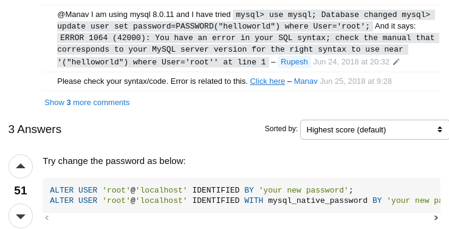

OBSERVAÇÕES DO CAPÍTULO\
 \
Estudando o capítulo 7 do livro de Node Essencial (Bio no README.md desse repositório), observei algumas coisas importantes no decorrer do capítulo, incluindo uma breve observação do autor de que temos que pesquisar por conta para instalar e configurar o mysql, já que o mysql aqui será uma ferramenta.\
\
De inicio tive dificuldades com o Mysql, mas consegui fazer a instalação sem problemas pelo apt do Ubuntu 23.10, criar o usuário de estudo e também os privilégios, seguindo parte do tutorial inicial do livro e também pelo link: https://www.digitalocean.com/community/tutorials/how-to-install-mysql-on-ubuntu-22-04#step-1-installing-mysql .\
\
Caso necessite zerar o auto-incremento na tabela, no mysql faça os seguintes comandos:\  
SET  @num := 0;\
UPDATE your_table SET id = @num := (@num+1);\
ALTER TABLE your_table AUTO_INCREMENT =1;\

\ 
Na sessão 7.10 tive dificuldades com a conexão com o banco de dados, mas a solução encontrei no stackoverflow e funcionou, seque o link: https://stackoverflow.com/questions/51008807/nodejs-mysql-client-does-not-support-authentication-protocol \
 \
 \ 